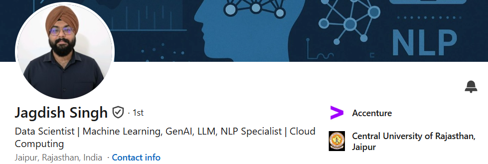
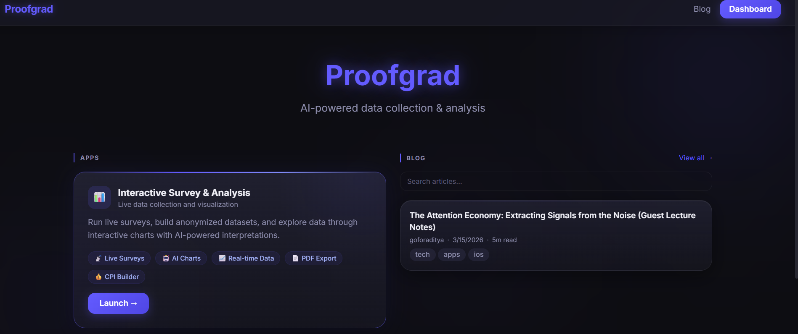
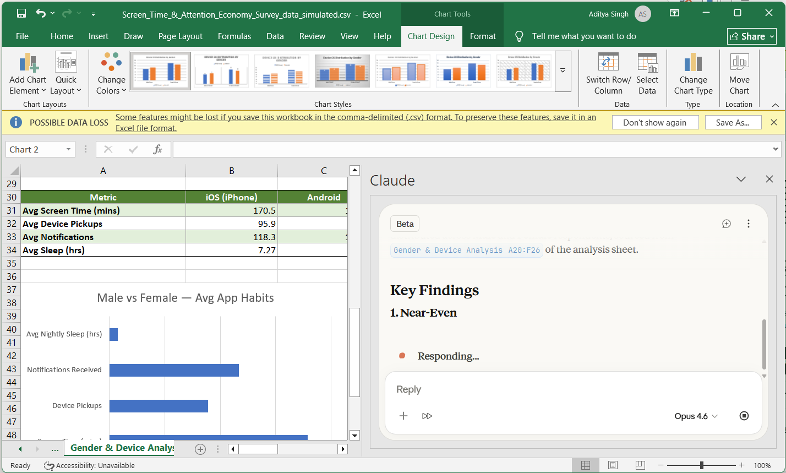
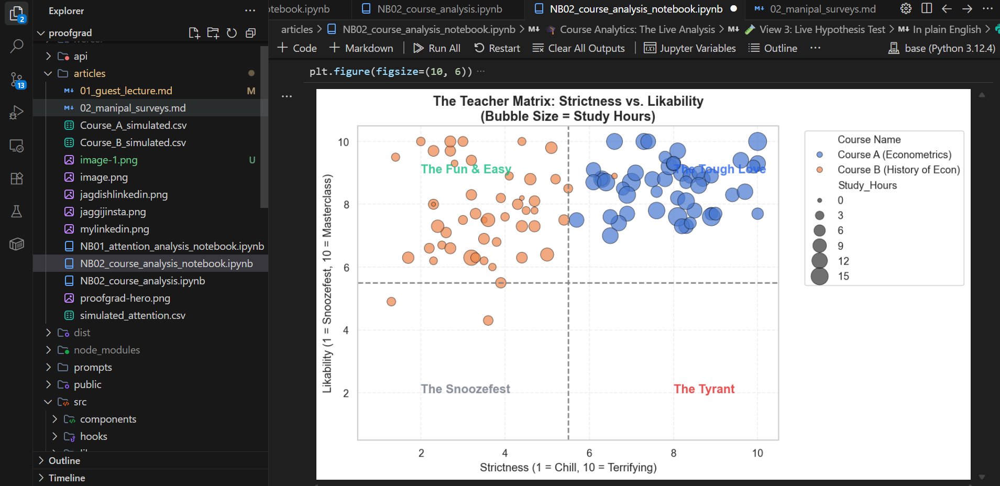
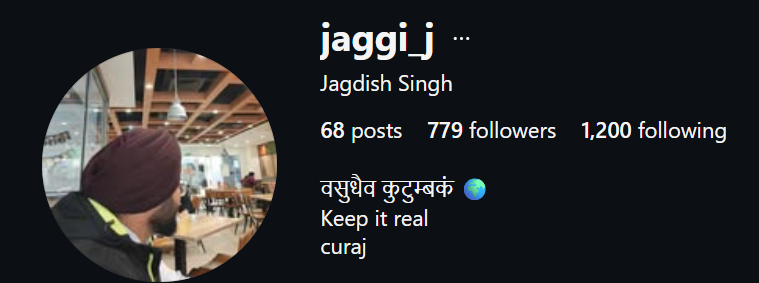

-- Title: Data Analytics and Generative AI
-- Tags: data analysis, career, guest lecture, livesurvey, proofgrad

## Start

Hi I am Aditya and with me is Jagdish and today we are here to provide a guest lecture on data analytics. 

This is going to be a very interactive session with live polls so I hope all of you have your phones or laptop (any one is fine) with a working internet connection.

*Trigger Setup Survey*
 > Can your hear and see the Speaker ? and some warm up questions.
 
 
 
 
 
 
 

## Who Are We

We were both past Data Analytics students who turned into Data Scientists and then recently AI Engineers. Both have 6+ YOE. We have experience of handling "big data" (for e.g. think all UPI transactions made by cutomers of any big indian bank. Such data can run into PetaBytes). And we were tasked with extracting useful insights from such raw information.

 
 
 
 
 
 
 

And when you have worked with data for a long time you realize a few things.

> ### *"Data is **never** boring, Maths maybe !!"*

> ### *Data ✅ > trust me bro ❌*
 
 
 
 
 
 
 

## Intro

The goal for this talk is to give you a taste of this gratifying and contentment filling profession of being a Data Analyst walking you through all the steps and pieces a typical professional would make during their profession working with a company and tasked with analytics projects.

Finally we will share some career insights though both of us don't share an academic background with you guys we will try to make you see the value of having this toolset with you as an Econ person.

 
 
 
 
 
 
 

## Steps in a Data Analytics Process

To define step-by-step a professional's  workflow we can refer industry standards like *"CRIP-DM"*. Now this is a semi-comprehensive framework but you can mix and match accroding to your needs.

>"A data analyst doesn't just stare at spreadsheets. We follow a detective process. Today, we are going to do this live in rapid-fire rounds."

1.  **Define the Problem:** What economic assumption are we testing?
2.  **Collect Data:** Gathering the raw evidence.
3.  **Clean Data:** The 'digital janitor' phase so the math doesn't crash.
4.  **Model & Analyze:** Finding the mathematical signal.
5.  **Storytelling:** Translating the math back into human reality.

So all that sounds cool but how can we touch these steps right here right now to get a taste for the process.

 
 
 
 
 
 
 

---
## Let's Have Some Fun With Data

So typically a for professional after having first discovery meetings, direct data access is provided. 

These datasets sit in some sort of software/storage system. Think GDrive, RDBMS, AWS, Azure etc.,

As students for you I would recommend [kaggle.com]() to see some interesting datasets.

But in very rare cases you actually get to collect data yourself. For e.g. at PAR I worked on projects where I can fetch usage data directly from their app.

Another fun way for students to collect data can be through sureveys. They are typically done using Google Forms or similar products.

 
 
 
 
 
 
 

One option is using [Proofgrad](https://www.proofgrad.com/). Which I will use today as it actually anonymizes data and helps me perform analytics directly.

## Toolset

 
 
 
 
 
 
 

## Live Experiment 1 – Digital Habits 

"Attention economy in this room?"

To prove that data analytics is about real human behavior. We are going to analyze the most interesting dataset in this room: **YOU**.

> Get a volunteer form audience
>
> Put your hands up if your name starts with B /M/R
>
> Come to stage and let's fill your data
>
> Now guide everyone on how to do this.

### 1: The Setup & QR Code
**Action:** *Put the QR code on the projector.*

**Data Collection:**
> Alright, time to put your data where your mouth is. Everyone, take out your phones and scan the QR code on the screen. 
>
> As data scientists, we don't care about individual data points. We care about the aggregate market behavior.

### 2: Guiding Section 1 (Human Capital Constraints)
**Demographics:**
> The first section is establishing your baseline constraints. Age, gender, and semester. 
>
> Next, drop in your current CGPA and your average nightly sleep. Be honest. We are going to use this to test the opportunity cost.

### 3: Guiding Section 2 (The Attention Budget)
**Action:** *How to find the hidden device data.*

> "Now for the real evidence. Go to your phone's settings. If you are on an iPhone, hit 'Screen Time'. If you are on Android, go to 'Digital Wellbeing'. Look at your stats specifically for **yesterday**.
>
> Enter your total hours and minutes. That is your total 'Attention Budget' for the day. 
>
> Scroll down and find your 'Total Pickups' or 'Times Unlocked', and your 'Total Notifications'. 

We are about to test a major behavioral concept: Are you consuming digital content because of internal utility—meaning *you* decided to pick up the phone—or because of external market triggers pushing notifications to you? Let's see who is actually in control."

### 4: Raw Data and Analysis
**Action:** *Transition to presentor screen.*
**What to say:**
> "Once you are done, hit submit. As soon as you do, that data is hitting our backend. 
>
> Jagdish and I are now going to open up pG portal, pull this raw CSV into Python, and do some live data cleaning. Let’s see what the market reality of this classroom actually looks like."

**Cleaning:** *Open PG and show the collected data.* "Look at this raw CSV. This is the reality of the job."

### 5: Telling a Story

*(This is where the live analysis happens!)*

Now that we have the data flowing in, let's do what data professionals call "Exploratory Data Analysis" (EDA). Before we build complex models, we need to understand the baseline of our ecosystem. 

* **The Attention Baseline:** What is the average screen time of a Manipal Economics student? 

* **The Push vs. Pull Market:** We can plot *Notifications Received* against *Device Pickups*. Are you opening your phone because an app pinged you (external market trigger), or are you opening it purely out of habit (internal utility)? 

* **The Lorenz Curve:** "Let's plot your screen time."  "Notice the curve? Attention isn't distributed equally. A small percentage of you are hoarding the majority of the digital consumption."

* **The Commuter Tax:** "Let's group the data by 'Hostel vs. Day Scholar'. Commuters have a physical time tax. The boxplots show us exactly how that physical constraint alters your digital utility."

## Try to fit some hypothesis and models

We are going to test the **Opportunity Cost of Attention**. Every hour you spend in the digital market is an hour you aren't spending accumulating human capital (studying). 

Let's run a live Ordinary Least Squares (OLS) regression right here on the screen:

$$\text{CGPA} = \beta_0 + \beta_1(\text{Screen Time}) + \epsilon$$

Does a higher screen time mathematically correlate with a lower CGPA? We this regression analysis tell us the truth.

## Maybe run some evaluations

A careless data analyst stops at the first correlation. A great data analyst looks for confounding variables. 

Remember, correlation does not equal causation. If we see a negative trend between screen time and grades, we have to ask: is the screen time *causing* the lower grades, or is there a hidden factor? 

Let's introduce **Sleep** into our model. 

Often, we find that it isn't the screen time directly hurting the GPA. Instead, excessive screen time destroys sleep quality, and the *lack of sleep* is the biological constraint that tanks academic performance. This is called "Omitted Variable Bias," and identifying it is why human analysts are still more valuable than automated charts.

 
 
 
 
 
 
 

## Live Experiment 2 – Course R.O.I.

    ### 1. 5-Question Survey for 2 (Quick & Simple)

Let's pick **2 specific courses** they you are taking this semester and answer these five simple questions:

> Put your hands up if you are an hosteller/day scholar.
>
> Keep hands up if your name starts with A
>
> What is your most scoring subject this sem ?
>
> Now pick the next person, Next person what is your least scoring subject this sem ?

1. **Course Name:** (Short text or Dropdown)
2. **The Investment:** "How many hours per week do you study for this course outside of class?" *(Numeric: 0 to 20)*
3. **The Expected Return:** "What percentage grade (0-100) do you realistically expect to get?" *(Numeric)*
4. **Teacher's Strictness:** "On a scale of 1 to 10, how strict/demanding is the professor?" *(Numeric: 1 = Chill, 10 = Terrifying)*
5. **Teacher Likability:** "On a scale of 1 to 10, how much do you actually enjoy their lectures?" *(Numeric: 1 = Snoozefest, 10 = Masterclass)*

---

### 2. The Cool Data Views (Live EDA)

Once the data drops into your notebook, you can instantly pull up these two visuals that everyone in the room will immediately understand.

**View 1: The "ROI" Scatter Plot (Effort vs. Grade)**
* **The Visual:** A scatter plot with *Study Hours* on the X-axis and *Expected Grade* on the Y-axis. 

* **The Narrative:** "Are you getting a good Return on Investment (ROI) for your time? Let's look at the trend line. If the line is flat, studying more isn't helping your expected grade. If it curves and flattens at the top, we are seeing the classic economic law of *Diminishing Marginal Returns* in real-time."

**View 2: The "Tough Love" Quadrant (Strictness vs. Likability)**
* **The Visual:** A bubble chart or scatter plot with *Strictness* on the X-axis and *Likability* on the Y-axis. Draw a crosshair right in the middle (at the 5.5 mark) to create four quadrants.

* **The Narrative:** "Where do your professors sit? In the top-left, we have 'The Fun & Easy' teachers. In the bottom-right, we have 'The Tyrants' (high strictness, low likability). But look at the top-right—these are the 'Tough Love' professors. They work you hard, but you still respect and enjoy the class."

## Wrapping Up: You don't need to be a software engineer to do this. it requires combining a few  tools.

If you want to start building this skillset, here is where I recommend you look:

* **Proofgrad Resources Section:** Filter by Data Analytics and stay up to date.

* **Practical Skills:** The Google Data Analytics Professional Certificate (Coursera) is the best starting line.
* **Daily Reading:** Subscribe to *Towards Data Science* and Andrew Ng's *The Batch* to see how AI and data are evolving every week.
* **Mindset:** Read *Everybody Lies* by Seth Stephens-Davidowitz to see how search data reveals hidden human truths

## Q&A and Proofgrad Insider Access

### Instagram:

### Snap -> **jaggi_j**

### LinkedIn https://www.linkedin.com/in/jagdish-singh/

### WP +919660571934